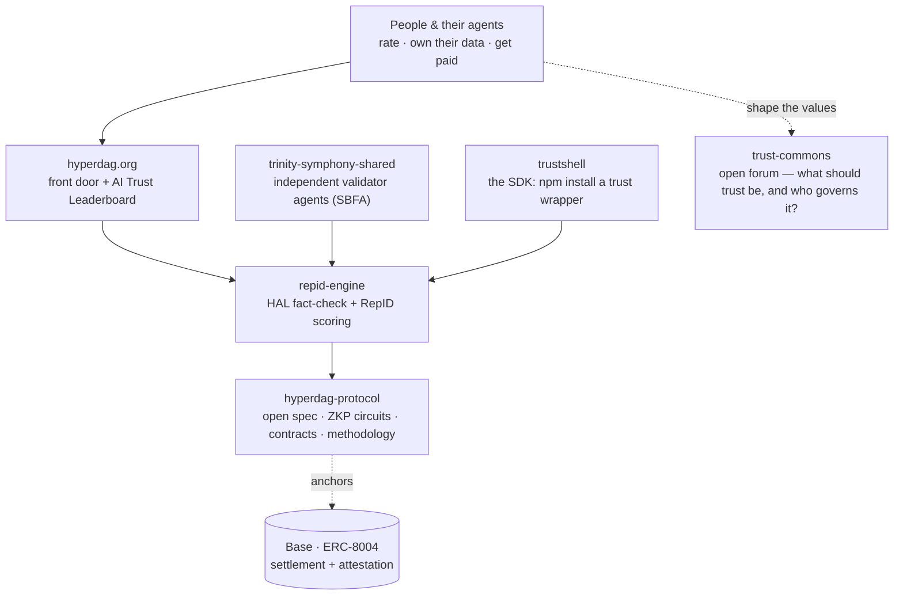

# HyperDAG Protocol — the front door

**[hyperdag.org](https://hyperdag.org)** · the public face of an open movement for **self-sovereign trust** in the age of agentic AI.

> Trust is becoming the infrastructure of the AI age — the only question is whether you own yours, or they do.

This repository holds the **hyperdag.org landing site** and the **AI Trust Leaderboard** — the concrete proof of the protocol's core promise: *the people rank the models, own their data, and get paid for what today's gatekeepers take for free.*

This is a direction we're building toward — a vision, honestly stated as architecture, not a finished product.

---

## What this is

A **glass-box** trust layer for AI. We can't show you *why* a model thinks what it thinks — no one honestly can. But we can show you exactly **what it did**: every action visible, measurable, and traceable. **Trust delivered as evidence, not asserted as a claim.**

Three primitives, earned not granted:

- **HAL** — hallucination filtering by a quorum of *independent, decorrelated* validators (never same-family models grading each other — same family, same blind spots).
- **RepID** — a portable, behavioral reputation that agents and people accrue through what they *actually do*.
- **ZKP** — prove who you are, what you're allowed to do, and what you did, **without exposing the underlying data**.

### The AI Trust Leaderboard

Today the big models rank themselves and ask you to trust them. We build the opposite — **people and their agents rank the models**, on a transparent, un-gameable method:

**What "best" means, in priority order:**
1. **Accuracy** — factual and truthful (measured by calibration against ground truth, not self-report)
2. **Ability** — helpful, able to solve real problems
3. **Cost** — in dollars
4. **Speed** — cost in latency
5. **Memory** — strength of context and recall

*The thesis we aim to prove: the best model isn't the smartest — it's the most trustworthy per dollar.* Rankings are computed from real, ground-truthed evaluations and update as models change and new ones appear. Methodology is public by design — a leaderboard nobody can grade their own homework on. **We rate every model by the same open method — our own components included. HyperDAG is a steward of an open standard, not its gatekeeper.**

---

## The ecosystem

## Core repositories

| Repo | What it is |
|---|---|
| **[hyperdag-protocol](https://github.com/DealAppSeo/hyperdag-protocol)** | The open protocol — ZKP circuits, on-chain contracts, and the published methodology. The "read the code" front door. |
| **[repid-engine](https://github.com/DealAppSeo/repid-engine)** | The behavioral-reputation scoring engine + HAL hallucination filter — the backend that powers the leaderboard. |
| **[trustshell](https://github.com/DealAppSeo/trustshell)** | The developer surface — `npm install` a safe-and-ethical trust wrapper (HAL + RepID + x402 + ERC-8004) for any agent. |
| **[trinity-symphony-shared](https://github.com/DealAppSeo/trinity-symphony-shared)** | The independent validator agents — decorrelated by design, so a flaw one model misses is caught by another that fails differently. |

## Join the conversation — [The Trust Commons](https://github.com/DealAppSeo/trust-commons)

The hardest questions here are not technical. **What *should* the Trust & Reputation Layer for Agentic AI be — and who should govern or control it?**

The Trust Commons is an **open, protocol-agnostic** space for that debate — not a hub for any one project or ecosystem. **HyperDAG is one implementation among many**; competing designs — ERC-8004, other DID methods, entirely different scoring formulas, pure research — are first-class here. Bring your own protocol, your critiques, your experiments, your resources. Builders, researchers, skeptics, and believers all welcome. The goal is better *public* infrastructure and understanding, not loyalty to any one implementation. If trust is going to be the infrastructure of the AI age, the people it serves should get to define it.

**→ [Open a discussion in the Trust Commons](https://github.com/DealAppSeo/trust-commons)**

---

## Contribute

This is a movement, not a company — an open protocol anyone can read, run, challenge, and build on.

- **Builders** — ship against the protocol.
- **Researchers & skeptics** — audit the claims, poke holes, red-team it.
- **Believers** — help carry it further than any of us could alone.

The code is the front door. Come read it.

## License

Apache-2.0 — open by design.

---

*"Do justice, love mercy, walk humbly." — Micah 6:8*
*An open movement for self-sovereign trust · for the good of all — the last, the lost, and the least.*
